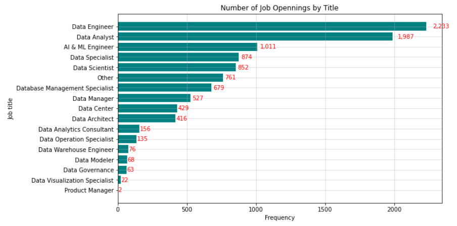
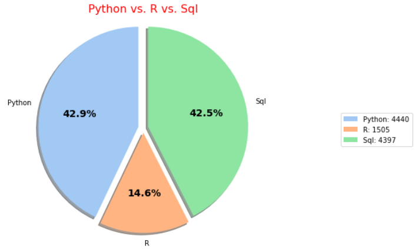
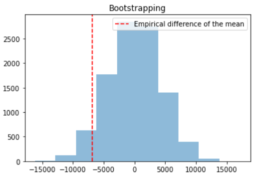
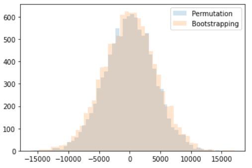

<!--  -->

# Motivation
Job analysis is a systematic process used to understand the responsibilities and skills needed to perform a specific job effectively. Not only providing companies and organizations with information to find candidates who are best fit for specific jobs, job analysis also benefits employees by setting clear performance expectations and understanding their role. 
# About the Project
This project focuses on the U.S. data-related job market in the January of 2024. The objectives are to identify trending current data jobs in the market and their relative salary, as well as to determine common skills required in the data field. Through this project, we aim to gain hands-on experience in skills such as preprocessing raw data, data visualization and A/B testing, to  gain more useful insights into the data field.

# Project Workflow
More details in the `data_cleaning.py` and `analysis.ipynb` files.

## 1. Data Collection  
The data set can be found [here](https://www.kaggle.com/datasets/asaniczka/data-science-job-postings-and-skills/data?select=job_skills.csv) and contains raw text information about data job postings collected from LinkedIn. It is split into three files:
- `job_postings.csv`
- `job_skills.csv`
- `job_summary.csv`
    
## 2. Data Cleaning
- Extract the salary from the job description and convert all hourly, daily, monthly salaries into annual salary. 
- Track the frequency of skills mentioned in a job description.
- Standardize the job titles.
- Identify and extract city and state from the job location column.

## 3. Exploratory Data Analysis
In this phase, we'll perform EDA to answer the following questions:
- What are the most popular jobs in the data field?
- What is the average salary for positions in the data field?
- Which regions show the highest job growth?
- Which regions pay the highest for data-related jobs?  
- What are some commonly required skills for the jobs?

## 4. A/B Testing
- Apply some traditional hypothesis testing methods such as Welch's test for the difference between means of two independent samples, and Kruskal-Wallis test to compare the means of three independent samples. 
- Utilize resampling techniques, like bootstrapping and permutation testing, to validate the results from the traditional methods.

# Related Reading
[1] [How to Perform an ANOVA with Unequal Sample Sizes](https://www.statology.org/anova-unequal-sample-size/#:~:text=It%20can%20be%20shown%20that,probability%20of%20detecting%20true%20differences.) by Zach Bobbitt.

[2] [Bootstrapping vs. Permutation Testing](https://towardsdatascience.com/bootstrapping-vs-permutation-testing-a30237795970) by Yevgeniy (Gene) Mishchenko.

[3] [Bootstrap Methods and Permutation Tests*](https://web.archive.org/web/20060215221403/http://bcs.whfreeman.com/ips5e/content/cat_080/pdf/moore14.pdf) by Tim Hesterberg et al.

[4] [Bootstrapping (statistics)](https://en.wikipedia.org/wiki/Bootstrapping_(statistics)), Wikipedia.
